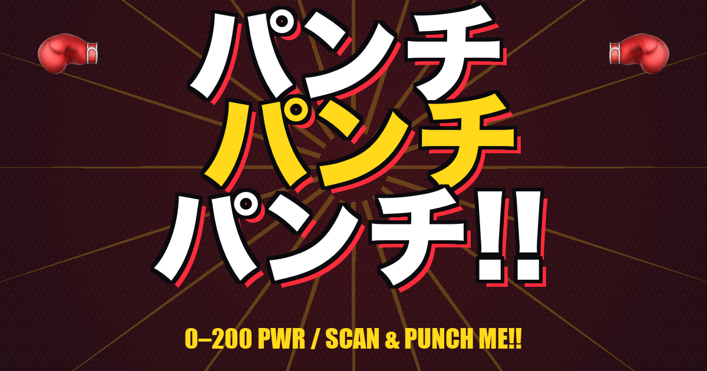

# 🥊 パンチパンチパンチ

スマホ握って思いっきり殴れ。加速度センサーで **0–200 PWR** に換算し、20階層の格闘家タイプで判定する少年漫画風パンチングマシーン。

🌐 **https://ta1m1kam.github.io/punch-power/**

[](https://ta1m1kam.github.io/punch-power/)

---

## ✨ 機能

- **DeviceMotion API** でスマホのピーク加速度・方向・ジャークを計測
- **論文ベースの多要素評価**（後述）で「ガタガタ振り」を弾く
- **0–200 PWR スケール**、100超で「**人間の壁突破**」ガラス破壊エフェクト＋画面シェイク＋シャッター音
- **20階層の格闘家タイプ判定**（赤ちゃん → 事務職 → アマチュアボクサー → 世界ランカー →（**100超 = 超人**）→ 怪人 → 雷神 → 破壊神 → 全知全能）と煽り判定コメント
- **挑戦URLバトル**：自分のスコアを埋め込んだURLを生成 → Tシャツに貼ったQRから読み取った相手と非同期バトル（WIN/LOSE判定付き）
- **スコア帯別OGP画像**（20種）：共有時にレベルに応じたカードが表示される
- **Web Audio API シンセSFX/BGM**：スロットチクタク、ガラスシャッター、ファンファーレを完全合成（外部音源ファイル不要）
- **コミック風UI**：ハーフトーン、コマシャドウ、黒×レッド×イエローの少年漫画パレット

---

## 🔬 採点アルゴリズム

「peak G が高ければ高得点」では、ただスマホをガタガタ振るだけで超人になれてしまう。そこでボクシング/格闘技のバイオメカニクス研究を参照し、**真の「良いパンチ」の物理特性**を多要素で評価しています。

### 参照研究

| 出典 | 採用した数値 |
|---|---|
| **Lan et al. 2022**, [Biomechanics of the lead straight punch of different level boxers](https://pmc.ncbi.nlm.nih.gov/articles/PMC9798280/), *Frontiers in Physiology* | Elite boxer peak fist velocity **7.16 ± 0.48 m/s** / peak time **17 ± 2 ms** / movement time **45 ± 5 ms** / RFD **88.6 N/ms** |
| **Walilko et al. 2005**, *Br J Sports Med* | Heavyweight boxer の peak hand acceleration 最大 **520 m/s² (53G)** |
| [Biomechanics of Punching — Effective Mass and Force Transfer](https://www.mdpi.com/2076-3417/15/7/4008), MDPI Applied Sciences 2025 | パンチ動作の最低閾値 **12 m/s²**（重力差分）|
| [Reliability of Low-Cost IMU to Measure Punch and Kick Velocity](https://www.researchgate.net/publication/387819118) | スマホ/低コストIMUによる強度計測の妥当性 |

### スコア式

```
raw   = max(0, peakDev − 12) × 1.8
final = clamp(0, 200, raw × riseFactor × shakeFactor × durFactor × dirFactor)
```

`peakDev` は重力ベースライン（≈9.81 m/s²）から差し引いた加速度ピーク。**peakDev ≈ 123 m/s² (12.6G)** で天井 200 PWR ＝ Walilko 報告のヘビー級下限相当。

### 4 つの factor（掛け算で割引）

| Factor | 1.0 になる条件 | 最低値 | 根拠 |
|---|---|---|---|
| **riseFactor** | rise time ≤ 50ms（30%peak から peak まで）| 0.4（>200ms）| Lan et al. の elite peak time = 17ms。スマホ持ち手で +30ms 余裕 |
| **shakeFactor** | ピーク以外に高いピークが無い | 0.35 | 真のパンチは movement time 45ms = 1ピーク。ピーク時刻から 200ms 以上離れた所に >70% peak があれば「ガタガタ振り」とみなす |
| **durFactor** | 50%peak 超の時間幅が 25–300ms | 0.55（>500ms）| 一般的なパンチは ~150ms で完結。長すぎるのは揺らしているだけ |
| **dirFactor** | ピーク時の 1 軸支配率が高い | 0.7 | 等方ベクトル ≒ 0.58、完全 1 軸 = 1.0。まっすぐ突きを優遇 |

### 実測比較（ヘッドレス検証）

| 動作 | peak m/s² | 旧スコア | 新スコア | 判定 |
|---|---|---|---|---|
| クリーン突き（単軸 単発 50 m/s²）| 50.2 | 126（ヒーロー / 超人） | **69** | アマチュアボクサー |
| ガタガタ振り（多軸 1.8s 持続 55 m/s²）| 55.1 | 137（怪人 / 超人） | **6** | 赤ちゃん |

**11 倍以上の差**で「殴った」と「揺らした」を区別。

---

## 🥋 ランク表

10 PWR 刻み、計 20 階層。

| Lv | PWR | 階級 | 格闘家タイプ | 煽り |
|---:|---:|:---:|---|---|
| 0 | 0–9   | 人間 | 赤ちゃん | お前ほんとにパンチした？ |
| 1 | 10–19 | 人間 | 子供 | お年玉でジュース買えそう。 |
| 2 | 20–29 | 人間 | 一般市民 | 平和主義だな、安心した。 |
| 3 | 30–39 | 人間 | 事務職 | デスクワーク向きの拳。 |
| 4 | 40–49 | 人間 | 体育会系 | 部活やってた？って感じ。 |
| 5 | 50–59 | 人間 | ケンカ自慢 | 街でちょっと有名なタイプ。 |
| 6 | 60–69 | 人間 | ヤンキー | 夜の公園の主か？ |
| 7 | 70–79 | 人間 | アマチュアボクサー | 練習してるな？やるじゃん。 |
| 8 | 80–89 | 人間 | プロ格闘家 | お前、格闘家？ |
| 9 | 90–99 | 人間 | 世界ランカー | お前、世界ランカーか？ |
| **10** | **100–109** | **超人** | **覚醒人類** | **人間の壁、突破。** |
| 11 | 110–119 | 超人 | 異能者 | お前、何か覚醒したな？ |
| 12 | 120–129 | 超人 | ヒーロー | マントいる？ |
| 13 | 130–139 | 超人 | 怪人 | ヒーロー協会から討伐依頼が来てる。 |
| 14 | 140–149 | 超人 | 改造人間 | 腕に何か仕込んだろ。 |
| 15 | 150–159 | 超人 | 半神 | 神域に片足突っ込んでる。 |
| 16 | 160–169 | 超人 | 雷神 | スマホから雷鳴った。 |
| 17 | 170–179 | 超人 | 破壊神 | 次元を割らないでくれ。 |
| 18 | 180–189 | 超人 | 創造主 | 世界を創るタイプの拳。 |
| 19 | 190–200 | 超人 | 全知全能 | 神も恐れる存在。お前、誰だ？ |

---

## 🥷 挑戦URLバトル

T シャツ着用者の最高スコアを QR 経由で送りつけ、読み取った相手と非同期対戦できる仕組み。

```
共有URL: https://ta1m1kam.github.io/punch-power/c/{level}/?c={score}&n={name}
例:      https://ta1m1kam.github.io/punch-power/c/12/?c=128&n=TAIGA
```

| アクセス主体 | 動作 |
|---|---|
| OGPスクレイパー（X / Slack / Discord） | `/c/{level}/index.html` に静的に書かれた **og:image = `og/lv-{level}.png`** を読み取り、レベル別の挑戦カードを表示 |
| 実ユーザー（ブラウザ） | `/c/{level}/` の JS で `../../?c=...&n=...` にリダイレクトされ、本体アプリで挑戦バトル開始 |

挑戦URLは結果画面の「挑戦URL」ボタンから生成。お好みのQR生成サービスでQR化してTシャツへ。

---

## 🎮 操作

1. スマホで開く（PCはセンサー無いので不可）
2. **READY!?** をタップ → センサー利用許可（iOS は初回のみ）
3. 3-2-1 のカウントダウン後、**全力で空気を殴る**
4. ピーク加速度から多要素評価でスコア算出
5. 100 超なら ガラス破壊 → 超人階級へ
6. 結果画面で **もう一発 / 挑戦URL / SHARE** を選択

🔇 左上のボタンでサウンドミュート可。

---

## 🛠️ 技術スタック

- **Vanilla HTML/CSS/JS**（フレームワーク無し、`index.html` 単一ファイル）
- **DeviceMotion API**（iOS 13+ は `requestPermission` 対応済み）
- **Web Audio API**（SFX/BGMをすべてオシレータ合成）
- **GitHub Pages** ホスティング
- **localStorage** でハイスコア・ミュート設定永続化
- ビルド資産は **Python + Pillow + qrcode** でローカル生成

---

## 📂 リポジトリ構成

```
punch-power/
├── index.html           # 本体アプリ（HTML/CSS/JS全部入り）
├── og/
│   ├── main.png         # メインOGP（1200×630）
│   └── lv-0.png .. lv-19.png   # レベル別OGP（20枚）
├── c/
│   └── 0/index.html .. 19/index.html   # レベル別ランディング（OGPメタ + JSリダイレクト）
├── qr.png               # サイトQRコード（中央🥊バッジ + 角丸モジュール）
├── qr_tshirt.png        # Tシャツプリント用QR（PUNCH POWER!! ロゴ入り）
├── qr.svg               # ベクター版QR
├── _make_qr.py          # QR生成スクリプト
└── _make_og.py          # OGP & ランディングページ生成スクリプト
```

---

## 🔧 ローカル起動

```bash
git clone git@github.com:ta1m1kam/punch-power.git
cd punch-power
python3 -m http.server 5175
# http://localhost:5175/ をスマホ実機で開く（同一ネットワーク）
```

OGP画像 / QR を再生成する場合：

```bash
pip3 install --user qrcode pillow
python3 _make_qr.py     # qr.png, qr_tshirt.png, qr.svg を再生成
python3 _make_og.py     # og/*.png と c/*/index.html を再生成
```

`_make_*.py` は macOS の Apple Color Emoji フォントとヒラギノ角ゴシックを使うので、他環境では適宜フォントパスを差し替えてください。

---

## 📝 ライセンス

MIT

## 👤 Credits

- Built by [@ta1m1kam](https://github.com/ta1m1kam)
- Pair-coded with Claude Opus 4.7 (1M context)
